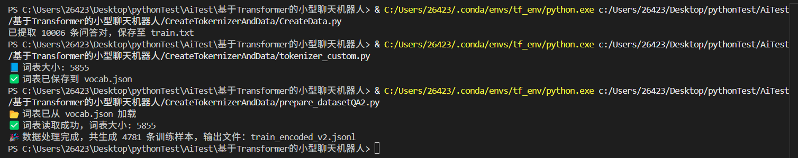
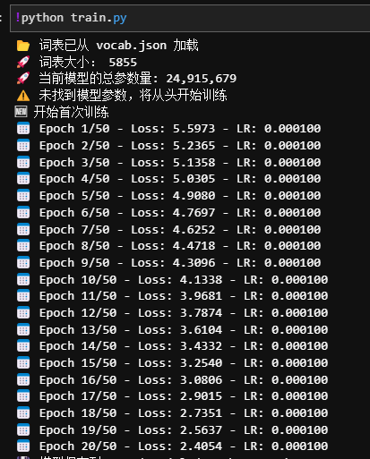
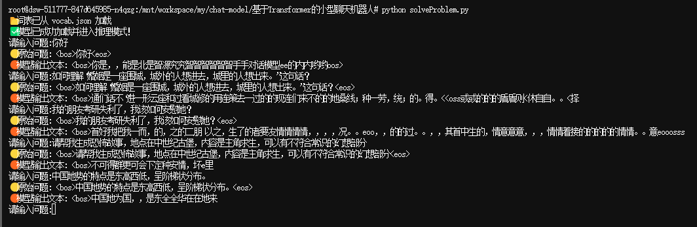
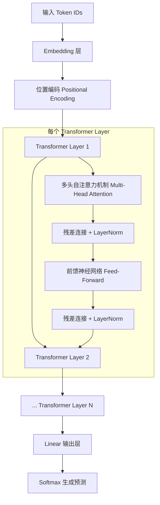

# 📌 Introduction前言

在本项目中，我们将构建一个基于 Transformer 架构的中文 GPT-2 模型。该模型利用深度学习技术，能够进行自然语言处理任务，包括文本生成、问答系统以及对话系统等。本项目通过构建一个完整的神经网络模型，提供了用于训练、调优和推理的实现，并允许用户根据需要调整超参数和模型结构。

通过本项目，你将能够深入了解 Transformer 模型的工作原理，并且学会如何用 PyTorch 来实现一个具备中文处理能力的 GPT-2 模型。

- 此开源项目旨在完全从0开始，仅用不到一个1h！即可训练出仅为100M参数的传统Transformer模型。
- 使用的是阿里云天池实验室的单张A10显卡

In this project, we will build a Chinese GPT-2 model based on the Transformer architecture. This model leverages deep learning techniques to perform natural language processing tasks, including text generation, question answering systems, and conversational systems. By constructing a complete neural network model, this project provides implementations for training, fine-tuning, and inference, while also allowing users to adjust hyperparameters and model structures as needed.

Through this project, you will gain a deep understanding of how Transformer models work and learn how to implement a Chinese GPT-2 model using PyTorch.

- This open-source project aims to start completely from scratch, and it only takes less than 1 hour to train a traditional Transformer model with only 100M parameters.
- The training is conducted using a single A10 GPU from Alibaba Cloud's Tianchi Lab.

>  本项目中的 Transformer 模型参考自 Vaswani et al. 提出的《Attention is All You Need》论文（2017）。该论文提出了一种基于自注意力机制的模型架构，彻底改变了自然语言处理（NLP）领域。

>  论文链接：[Attention is All You Need](https://arxiv.org/abs/1706.03762)

>  感谢原作者的贡献！

***

> In this project, the Transformer model is inspired by the paper "Attention is All You Need" by Vaswani et al. (2017). This paper introduced a model architecture based on self-attention mechanisms, which has revolutionized the field of Natural Language Processing (NLP).

> Paper link: [Attention is All You Need](https://arxiv.org/abs/1706.03762)

> We extend our gratitude to the original authors for their contributions!

# 📌Project Introduction项目介绍

本项目实现了一个基于 Transformer 的 GPT-2 模型，主要包含以下功能：

- **词表构建**：根据输入文本文件自动构建词表，支持自定义最小词频筛选。
- **模型训练**：可以使用自定义数据集对模型进行训练，支持文本编码和解码功能。
- **推理与生成**：可以加载训练好的模型进行文本生成，适用于对话生成和问答任务。
- **模型结构**：采用了标准的 GPT-2 架构，包括位置编码、多头自注意力机制和前馈网络等组件。

项目的核心实现使用 PyTorch 框架，通过对大规模文本数据的训练来进行语言建模，并且可以根据具体任务进行微调。模型能够处理中文文本，并支持对话生成等任务。

🚀 当前模型的总参数量: 24,915,679

This project implements a Transformer-based GPT-2 model, which includes the following features:

- **Vocabulary Construction**: Automatically constructs a vocabulary based on the input text file, supporting custom minimum frequency filtering.
- **Model Training**: Allows training the model using a custom dataset, with text encoding and decoding functionalities.
- **Inference and Generation**: Can load the trained model for text generation, suitable for dialogue generation and question-answering tasks.
- **Model Architecture**: Adopts the standard GPT-2 architecture, which includes components such as positional encoding, multi-head self-attention mechanism, and feed-forward networks.

The core implementation of the project uses the PyTorch framework. It trains a language model on large-scale text data and allows fine-tuning based on specific tasks. The model is capable of processing Chinese text and supports tasks such as dialogue generation.

🚀 Current model's total parameter count: 24,915,679

# 📌Project Show项目展示

**Generating Formatted Data生成格式数据**



**Train Model训练模型**



练了50个epoch 

比较混乱



练到ok的状态即可

# 📌Model Design模型设计

本项目基于 Transformer 架构实现了一个中文 GPT-2 模型，包含了多个模块组成，确保了模型在自然语言处理任务中的高效性和灵活性。下面是模型设计的详细介绍：

This project implements a Chinese GPT-2 model based on the Transformer architecture, composed of several modules to ensure the model's efficiency and flexibility in natural language processing tasks. Below is a detailed introduction to the model design:

## 1. **词嵌入与位置编码（Embedding & Positional Encoding）**

### 词嵌入（Embedding）

模型使用嵌入层（`nn.Embedding`）将输入的词汇 ID 转换为一个固定维度的嵌入向量。每个词汇在模型中都有一个对应的嵌入表示，这些嵌入向量会在训练过程中学习得到。

The model uses an embedding layer (`nn.Embedding`) to convert the input word IDs into a fixed-dimensional embedding vector. Each word in the model has a corresponding embedding representation, which is learned during the training process.

### 位置编码（Positional Encoding）

为了处理序列中的位置关系，Transformer 模型使用了位置编码。位置编码是一个与输入序列长度相同的向量，它通过对不同位置的词汇应用正弦和余弦函数，帮助模型理解序列中词汇的相对位置。

To handle the positional relationships in the sequence, the Transformer model uses positional encoding. Positional encoding is a vector with the same length as the input sequence, created using sine and cosine functions at different positions to help the model understand the relative positions of words in the sequence.
$$
\begin{aligned}
PE_{\text{pos}, 2i} &= \sin\left(\frac{\text{pos}}{10000^{\frac{2i}{d_{\text{model}}}}}\right) \\
PE_{\text{pos}, 2i+1} &= \cos\left(\frac{\text{pos}}{10000^{\frac{2i}{d_{\text{model}}}}}\right)
\end{aligned}
$$
该编码方式的设计使得不同位置之间具有唯一性，并且任意两个位置的相对距离是可以通过其编码向量的线性变换表示出来的。

The design of the positional encoding ensures uniqueness between positions and that the relative distance between any two positions can be represented via linear transformations of their encoding vectors.

### ✅ Key Features特点总结：

- 使用正弦和余弦函数使得编码对不同位置具有周期性响应。
- 可以推广到序列长度之外（支持推理阶段更长序列）。
- 编码值不会被训练，是**固定的不可学习参数**。

- Uses sine and cosine functions to make the encoding exhibit periodic behavior for different positions.
- Can generalize beyond the sequence length (supports inference with longer sequences).
- The encoding values are fixed, non-learnable parameters.

## 2. **多头自注意力机制（Multi-Head Self-Attention）**

在 Transformer 架构中，最核心的组件是多头自注意力机制。该机制允许模型在处理某一词汇时，能够注意到输入序列中其他位置的相关信息，避免了传统 RNN 中信息传递的限制。

The core component in the Transformer architecture is the multi-head self-attention mechanism. This mechanism allows the model to pay attention to relevant information from other positions in the sequence when processing a word, overcoming the limitations of traditional RNNs in information propagation.
$$
\textbf{Step 1: 线性映射（Linear Projection）}

\begin{aligned}
Q &= XW^Q \\
K &= XW^K \\
V &= XW^V
\end{aligned}

\text{其中 } X \in \mathbb{R}^{B \times L \times d_{\text{model}}},\quad W^Q, W^K, W^V \in \mathbb{R}^{d_{\text{model}} \times d_{\text{model}}}

\\[12pt]

\textbf{Step 2: 分头（Split into Multiple Heads）}

\begin{aligned}
Q &\rightarrow Q_{\text{heads}} \in \mathbb{R}^{B \times h \times L \times d_k} \\
K &\rightarrow K_{\text{heads}} \in \mathbb{R}^{B \times h \times L \times d_k} \\
V &\rightarrow V_{\text{heads}} \in \mathbb{R}^{B \times h \times L \times d_k}
\end{aligned}

\text{其中 } d_k = \frac{d_{\text{model}}}{h},\quad h = \text{头数}
$$

### Mechanism Explanation机制说明：

- **多头**：自注意力机制被划分为多个头，每个头分别独立计算并最终合并，可以捕获不同的上下文信息。
- **自注意力**：每个词汇与自身及其上下文的所有其他词汇进行交互，学习到词汇之间的依赖关系。
- **线性变换**：每个头的 Q（查询）、K（键）、V（值）是通过对输入向量进行线性变换得到的。

- **Multi-head**: The self-attention mechanism is divided into multiple heads, each of which computes independently and is later concatenated, enabling the capture of different contextual information.
- **Self-attention**: Each word interacts with itself and all other words in its context, learning dependencies between words.
- **Linear Transformation**: The Q (query), K (key), and V (value) for each head are obtained by applying linear transformations to the input vector.

## 3. **前馈神经网络（Feed-Forward Network）**

Transformer 中每一层的自注意力机制后，都会跟随一个前馈神经网络（Feed-Forward Network），它由两个全连接层组成，通常中间加一个 ReLU 激活函数，用于增强模型的非线性表达能力。

Each layer of the Transformer follows the self-attention mechanism with a feed-forward network. This network consists of two fully connected layers, usually with a ReLU activation function in between, to enhance the model's non-linear expressive power.

- **Structure**: `Linear -> ReLU[Rectified Linear Unit] -> Linear`
- **Function**: The feed-forward network processes each position's representation independently to improve the model’s representational capability.

- **结构**：`Linear -> ReLU[Rectified Linear Unit（线性整流单元）] -> Linear`
- **作用**：前馈神经网络对每个位置的表示独立进行处理，从而提升模型的表示能力。

$$
\begin{aligned}
\text{FFN}(x) &= \text{Linear}_2(\text{Dropout}(\text{ReLU}(\text{Linear}_1(x)))) \\
&= \max(0, xW_1 + b_1)W_2 + b_2
\end{aligned}
$$

## 4. **层归一化与残差连接（Layer Normalization & Residual Connection）**

每一层的输入都通过残差连接与经过处理的输出相加，并进行层归一化（Layer Normalization）。这种设计有助于缓解深度神经网络中的梯度消失问题，加速训练过程。

- **残差连接**：每一层的输入与输出相加，保持信息的流动。
- **层归一化**：在每次加和之后进行归一化，以稳定训练过程。

Each layer's input is added to the processed output through a residual connection and then undergoes layer normalization. This design helps alleviate the vanishing gradient problem in deep neural networks and accelerates the training process.

- **Residual Connection**: The input of each layer is added to its output, preserving information flow.
- **Layer Normalization**: Normalization is applied after the summation to stabilize the training process.

$$
SubLayerOutput = Sublayer(x)\\
LayerOutput = LayerNorm(x + Dropout(SubLayerOutput))\\
Output = LayerNorm(x + Dropout(Sublayer(x)))
$$

## 5. **输出层与生成（Output Layer & Generation）**

在 Transformer 模型的最后，通过一个线性变换层（`nn.Linear`）将输出的隐层向量转换为词汇表大小的分布，用于生成下一词的预测。生成文本时，可以采用采样（Sampling）或者贪婪解码（Greedy Decoding）等策略。

At the end of the Transformer model, a linear transformation layer (`nn.Linear`) is used to convert the output hidden layer vector into a distribution of vocabulary size, which is used to predict the next word. During text generation, strategies such as sampling or greedy decoding can be applied.

## 6. **Model Architecture模型架构**

### 模型结构图：



### Detailed Description细节描述：

- 模型由 **多个 Transformer 层** 堆叠而成，每个层包括了 **自注意力层** 和 **前馈神经网络**。
- 输入通过嵌入层和位置编码层进行处理后，传入多个 Transformer 层，在每一层中都经过自注意力和前馈网络的计算，最后生成模型的输出。

- The model is composed of **multiple Transformer layers** stacked together, where each layer includes a **self-attention layer** and a **feed-forward network**.
- After the input is processed by the embedding layer and positional encoding layer, it is passed through multiple Transformer layers. In each layer, self-attention and feed-forward network operations are performed, ultimately generating the model's output.

# 📌Steps for Building the Model搭建步骤

## 1.Pull the repository拉仓库

```
!git clone https://gitee.com/jerry-simithgi/chat-model.git
```

## 2.Enter the project directory进入项目目录

```
cd chat-model/
```

```
cd 基于Transformer的小型聊天机器人/
```

## 3.Vocabulary Construction词表构建

### Ⅰ Generating Formatted Data生成格式数据

CreateTokernizerAndData\CreateData.py

**加载输入文件**：

- 代码从名为 `qa_final.json` 的 JSON 文件中读取对话数据。每条数据包含多个回合（turns），每个回合有一个 `role`（角色）和 `text`（文本内容）。

**提取问答对**：

- 遍历每条对话中的回合数据，寻找用户 (`role: "user"`) 提出的问题和 AI (`role: "ai"`) 的回答。
- 每当找到一对用户问题和 AI 回答，代码会将其格式化为 `BOS + prompt + SEP + response + EOS`，其中 `BOS` 是开始标记，`SEP` 是分隔符，`EOS` 是结束标记。这种格式是 GPT-2 模型所需要的。

**保存处理后的数据**：

- 格式化后的每一对问答对会被写入到 `train.txt` 文件中，每一行代表一个问答对。

**输出提示**：

- 在完成提取和保存操作后，代码会打印出已提取的问答对数量，并提示用户数据已保存至 `train.txt` 文件中。

运行该文件可以生成格式数据

**Loading the Input File**:

- The code reads conversation data from a JSON file named `qa_final.json`. Each entry contains multiple turns, with each turn having a `role` (e.g., "user" or "ai") and `text` (the content of the dialogue).

**Extracting Q&A Pairs**:

- The code loops through each turn in the conversation to find user (`role: "user"`) questions and AI (`role: "ai"`) answers.
- Each time a user question and AI answer are found, the code formats them as `BOS + prompt + SEP + response + EOS`, where `BOS` is the beginning token, `SEP` is the separator token, and `EOS` is the end token. This format is required by the GPT-2 model.

**Saving the Processed Data**:

- The formatted Q&A pairs are written into a `train.txt` file, with each line representing one Q&A pair.

**Output Message**:

- After the extraction and saving operations are completed, the code prints the number of extracted Q&A pairs and informs the user that the data has been saved to the `train.txt` file.

Running this file will generate the formatted data.

```
qa_final.json：
[
    {
        "turns": [
            {
                "role": "user",
                "text": "你好，我现在准备做一名小红书美妆博主，请问我该做些什么吗？可以给我一些详细的准备list"
            },
            {
                "role": "ai",
                "text": "当然! 以下是您可以采取的一些步骤来为您的小红书美妆博主之旅做准备：\n1.选择一个利基:确定你想要关注的特定美容领域。您对护肤、彩妆、护发或这些的组合感兴趣吗? 缩小你的利基将帮助你创建更有针对性的内容，你的观众会喜欢。\n2.研究您的受众: 通过浏览热门的小红书美妆账号了解您的潜在受众。观察他们参与最多的内容以及他们最感兴趣的主题。\n3.制定内容计划:针对您将创建的内容类型和频率制定计划。考虑哪种格式最适合您的利基市场，例如视频、照片或书面评论。提前计划您的帖子以保持一致的时间表。\n4.建立您的个人资料:创建代表您品牌的专业且具有视觉吸引力的个人资料。使用高质量的图像，并包含准确反映您的利基和个性的简历。\n5.发展合作伙伴关系: 在小红书上与其他美妆博主、品牌和影响者建立联系。与业内其他人建立关系有助于提高知名度和合作机会\n6.保持最新:了解美容行业的最新趋势和新闻。参加行业活动，阅读相关出版物，随时了解最新的产品和技术。\n7，与您的观众互动:通过回复评论和消息以及鼓励对您的帖子进行讨论来与您的关注者互动。这将有助于建立忠实的追随者并建立您在美容行业的权威。\n请记住在您的内容创作中保持真实、热情和一致。祝你的小红书美妆博主之旅顺利!"
            }
        ]
    },...
经过该文件处理后得到
The result obtained after processing this file.
<bos>你好，我现在准备做一名小红书美妆博主，请问我该做些什么吗？可以给我一些详细的准备list<sep>当然! 以下是您可以采取的一些步骤来为您的小红书美妆博主之旅做准备： 1.选择一个利基:确定你想要关注的特定美容领域。您对护肤、彩妆、护发或这些的组合感兴趣吗? 缩小你的利基将帮助你创建更有针对性的内容，你的观众会喜欢。 2.研究您的受众: 通过浏览热门的小红书美妆账号了解您的潜在受众。观察他们参与最多的内容以及他们最感兴趣的主题。 3.制定内容计划:针对您将创建的内容类型和频率制定计划。考虑哪种格式最适合您的利基市场，例如视频、照片或书面评论。提前计划您的帖子以保持一致的时间表。 4.建立您的个人资料:创建代表您品牌的专业且具有视觉吸引力的个人资料。使用高质量的图像，并包含准确反映您的利基和个性的简历。 5.发展合作伙伴关系: 在小红书上与其他美妆博主、品牌和影响者建立联系。与业内其他人建立关系有助于提高知名度和合作机会 6.保持最新:了解美容行业的最新趋势和新闻。参加行业活动，阅读相关出版物，随时了解最新的产品和技术。 7，与您的观众互动:通过回复评论和消息以及鼓励对您的帖子进行讨论来与您的关注者互动。这将有助于建立忠实的追随者并建立您在美容行业的权威。 请记住在您的内容创作中保持真实、热情和一致。祝你的小红书美妆博主之旅顺利!<eos>
```

### Ⅱ Generate Vocabulary File生成词表文件

CreateTokernizerAndData\tokenizer_custom.py

**构建词表** (`build_vocab_from_file`)：

- 从输入的文本文件（`train.txt`）中提取所有字符，统计每个字符的出现频率。
- 基于最小频率（`min_freq`）筛选出出现频率大于等于该阈值的字符，构建词表。
- 在词表中加入一些特殊标记：`<pad>`（填充符）、`<unk>`（未知符）、`<bos>`（开始标记）、`<sep>`（分隔符）、`<eos>`（结束标记）。
- 生成一个字符到 ID 的映射（`token2id`）和 ID 到字符的映射（`id2token`）。

**保存词表到文件** (`save_vocab_to_file`)：

- 将构建好的词表（`token2id` 和 `id2token`）保存为 JSON 格式，存储在指定的文件路径（`vocab.json`）中。

**从文件加载词表** (`load_vocab_from_file`)：

- 从保存的词表文件中加载词表（`token2id` 和 `id2token`），并将 ID 映射的键从字符串类型转回整数类型。

**文本编码** (`encode`)：

- 将输入的文本（如一句话）转换为一系列的 Token ID，使用词表中的映射。
- 在文本的开头和结尾分别添加 `<bos>` 和 `<eos>` 标记。
- 如果文本长度超过最大长度 `max_len`，则截断；如果文本长度不足，则用 `<pad>` 填充。

**文本解码** (`decode`)：

- 将编码后的 Token ID 转换回原始文本（字符）。
- 在解码过程中，如果遇到 `<eos>`，则停止解码。
- 跳过特殊符号 `<pad>`, `<unk>`, `<bos>`。

基于train.txt生成vocab.json（词表）

**Build Vocabulary** (`build_vocab_from_file`):

- Extract all characters from the input text file (`train.txt`) and count the frequency of each character.
- Filter out characters with a frequency greater than or equal to a given minimum frequency (`min_freq`) to build the vocabulary.
- Add special tokens to the vocabulary: `<pad>` (padding), `<unk>` (unknown), `<bos>` (beginning of sentence), `<sep>` (separator), and `<eos>` (end of sentence).
- Create two mappings: a character-to-ID mapping (`token2id`) and an ID-to-character mapping (`id2token`).

**Save Vocabulary to File** (`save_vocab_to_file`):

- Save the constructed vocabulary (`token2id` and `id2token`) as a JSON file to the specified path (`vocab.json`).

**Load Vocabulary from File** (`load_vocab_from_file`):

- Load the vocabulary (`token2id` and `id2token`) from the saved file and convert the keys of the ID mapping from strings back to integers.

**Text Encoding** (`encode`):

- Convert an input text (such as a sentence) into a series of Token IDs using the vocabulary mappings.
- Add `<bos>` at the beginning and `<eos>` at the end of the text.
- If the text exceeds the maximum length (`max_len`), truncate it; if it's too short, pad it with `<pad>`.

**Text Decoding** (`decode`):

- Convert the encoded Token IDs back into the original text (characters).
- Stop decoding when the `<eos>` token is encountered.
- Skip over special tokens like `<pad>`, `<unk>`, and `<bos>`.

Generate `vocab.json` (Vocabulary) based on `train.txt`.

## 4.Generate Dataset for Training生成用于训练的数据集

CreateTokernizerAndData\prepare_datasetQA2.py

**配置项和加载词表**：

- 设置了最大文本长度（`max_len`）和输入、输出文件路径。
- 加载事先构建好的词表（`vocab.json`）和映射，包含从字符到 ID 的映射（`token2id`）和 ID 到字符的映射（`id2token`）。
- 如果词表中缺少特殊标记（`<bos>`, `<sep>`, `<eos>`, `<pad>`），会自动添加并更新词表。

**处理单行数据**：

- `process_line` 函数用于处理每一行原始文本数据：
  - 校验数据格式，确保每行数据包含 `<bos>`, `<sep>`, `<eos>`。
  - 将问题（question）和回答（answer）部分提取出来，并添加适当的特殊标记（如 `<bos>` 和 `<eos>`）。
  - 使用 `encode` 函数将问题和回答转换为 Token ID 序列。
  - 填充或截断 Token ID 序列，确保每个序列的长度不超过最大长度 `max_len`。
  - 如果问题或回答中不包含 `<eos>` 标记，则丢弃该行数据。

**保存处理结果**：

- 对每一行数据进行处理，处理成功后将其保存为 JSON 格式（`input_ids` 和 `labels`）。
- 结果以 JSON 行（`.jsonl`）格式保存，便于后续的训练使用。

**执行和输出**：

- 读取原始训练数据文件（`train.txt`），逐行处理并将结果写入输出文件（`train_encoded_v2.jsonl`）。
- 输出处理成功的训练样本数，并生成一个处理后的数据文件。

基于vocab.json和train.txt生成用于训练的数据集

**Configuration and Vocabulary Loading**:

- Set the maximum text length (`max_len`) and input/output file paths.
- Load the pre-built vocabulary (`vocab.json`) and mappings, which include the character-to-ID mapping (`token2id`) and ID-to-character mapping (`id2token`).
- If any special tokens (`<bos>`, `<sep>`, `<eos>`, `<pad>`) are missing from the vocabulary, they will be automatically added and the vocabulary will be updated.

**Process Each Line of Data**:

- The `process_line` function processes each line of the raw text data:
  - Verify the data format, ensuring each line contains `<bos>`, `<sep>`, and `<eos>`.
  - Extract the question and answer parts, and add the appropriate special tokens (such as `<bos>` and `<eos>`).
  - Use the `encode` function to convert the question and answer into Token ID sequences.
  - Pad or truncate the Token ID sequences to ensure that each sequence does not exceed the maximum length (`max_len`).
  - If a question or answer does not contain the `<eos>` token, the line is discarded.

**Save Processed Results**:

- For each processed line, after successful processing, save it as a JSON format with `input_ids` and `labels`.
- The results are saved in a JSON Lines (`.jsonl`) format, which is convenient for later training use.

**Execution and Output**:

- Read the raw training data file (`train.txt`), process it line by line, and write the results to the output file (`train_encoded_v2.jsonl`).
- Output the number of successfully processed training samples and generate a processed data file.

Generate the training dataset based on `vocab.json` and `train.txt`.

```
<bos>“宫廷玉液酒”下一句是什么？它多少钱一杯？<sep>“宫廷玉液酒”的下一句是“一百八一杯”。它的价格是一百八十元一杯。<eos>
train.txt

经过处理后
得到
{"input_ids": [2, 5, 6, 7, 8, 9, 28, 97, 261, 515, 568, 131, 569, 570, 571, 572, 12, 573, 574, 575, 576, 409, 19, 577, 270, 578, 203, 357, 19, 579, 446, 580, 81, 5, 45, 7, 8, 9, 4, 0, 0, 0, 0, 0, 0, 0, 0, 0, 0, 0, 0, 0, 0, 0, 0, 0, 0, 0, 0, 0, 0, 0, 0, 0, 0, 0, 0, 0, 0, 0, 0, 0, 0, 0, 0, 0, 0, 0, 0, 0, 0, 0, 0, 0, 0, 0, 0, 0, 0, 0, 0, 0, 0, 0, 0, 0, 0, 0, 0, 0, 0, 0, 0, 0, 0, 0, 0, 0, 0, 0, 0, 0, 0, 0, 0, 0, 0, 0, 0, 0, 0, 0, 0, 0, 0, 0, 0, 0], "labels": [2, 5, 6, 7, 8, 9, 581, 582, 51, 569, 583, 41, 584, 570, 142, 585, 568, 41, 24, 586, 12, 19, 148, 515, 587, 142, 588, 589, 41, 92, 184, 590, 159, 290, 58, 81, 409, 591, 85, 574, 159, 142, 279, 48, 586, 577, 592, 59, 19, 542, 41, 593, 107, 586, 594, 5, 45, 7, 8, 9, 4, 0, 0, 0, 0, 0, 0, 0, 0, 0, 0, 0, 0, 0, 0, 0, 0, 0, 0, 0, 0, 0, 0, 0, 0, 0, 0, 0, 0, 0, 0, 0, 0, 0, 0, 0, 0, 0, 0, 0, 0, 0, 0, 0, 0, 0, 0, 0, 0, 0, 0, 0, 0, 0, 0, 0, 0, 0, 0, 0, 0, 0, 0, 0, 0, 0, 0, 0]}
2是<bos> 4是<eos>
在每个q(“宫廷玉液酒”下一句是什么？它多少钱一杯？),a(“宫廷玉液酒”的下一句是“一百八一杯”。它的价格是一百八十元一杯。)前后都加上<bos> 和 <eos>后进行编码。
```

## 5.Training训练

train.py

**配置参数**：

- 设置了训练的超参数，包括词表文件、训练数据文件、批处理大小、最大序列长度、训练轮数、学习率等。
- 指定了模型保存目录和日志文件，用于保存训练过程中每个阶段的模型及训练日志。

**读取词表**：

- 通过 `load_vocab_from_file` 函数加载词表文件（`vocab.json`），获取词到 ID 的映射（`token2id`）和 ID 到词的映射（`id2token`）。
- 输出词表的大小，供后续模型构建时使用。

**自定义数据集**：

- `QADataset` 类负责读取训练数据（存储在 `train_encoded_v2.jsonl` 文件中），对每一行数据进行处理，将文本转换为适合模型的输入格式。
- 每个样本包含 `input_ids` 和 `labels`，并填充到最大长度 `max_len`。
- 数据集使用 PyTorch 的 `Dataset` 类封装，并通过 `DataLoader` 提供批处理数据。

**构建模型**：

- 使用自定义的 `GPT2Transformer` 类构建 GPT-2 模型，模型包括词表大小、嵌入维度、注意力头数、层数等超参数。
- 计算模型的总参数量，并输出。

**损失函数与优化器**：

- 使用 `CrossEntropyLoss` 作为损失函数，忽略填充 token (`<pad>`)。
- 优化器使用 Adam，学习率为 `1e-4`，并使用 `StepLR` 学习率调度器，在每 50 轮后将学习率减半。

**加载预训练模型**：

- 提供了 `load_model` 函数用于加载已保存的模型参数，如果找到已保存的模型文件，则继续训练；如果找不到，则从头开始训练。

**训练函数**：

- `train` 函数执行模型的训练流程，包含以下步骤：
  - 加载数据并进行训练。
  - 每个 epoch 中计算损失，进行反向传播和优化步骤。
  - 每训练一定轮数（如每 20 轮）保存一次模型参数。
  - 记录每个 epoch 的损失和学习率，并保存到日志文件中。

**最终保存模型**：

- 训练结束后，最终保存模型参数到指定路径（`final_model.pth`）。

**图形与日志记录**：

- 文件中还包含了日志文件记录训练过程中的损失和学习率，并可通过图形化工具（如 matplotlib）进行训练结果的可视化（在该文件内并未使用，但通常可用于绘制损失曲线）。

训练后可以得到训练的参数文件

如果你想重头训练可以移走或删除文件（saved_models\final_model.pth）

**Configuration Parameters**:

- Sets training hyperparameters, including vocabulary file, training data file, batch size, maximum sequence length, number of epochs, learning rate, and more.
- Specifies the model save directory and log file to store model checkpoints and training logs during the training process.

**Read Vocabulary**:

- The `load_vocab_from_file` function is used to load the vocabulary file (`vocab.json`), retrieving the token-to-ID mapping (`token2id`) and ID-to-token mapping (`id2token`).
- Outputs the size of the vocabulary, which will be used for building the model later.

**Custom Dataset**:

- The `QADataset` class handles reading the training data (stored in `train_encoded_v2.jsonl` file), processing each line of data, and converting the text into a format suitable for the model.
- Each sample contains `input_ids` and `labels`, and these are padded to the maximum length (`max_len`).
- The dataset is wrapped in PyTorch's `Dataset` class and batched using `DataLoader`.

**Model Construction**:

- The custom `GPT2Transformer` class is used to build the GPT-2 model, including hyperparameters such as vocabulary size, embedding dimension, number of attention heads, and the number of layers.
- The total number of model parameters is calculated and outputted.

**Loss Function and Optimizer**:

- `CrossEntropyLoss` is used as the loss function, with the padding token (`<pad>`) ignored.
- The optimizer is Adam with a learning rate of `1e-4`, and the learning rate scheduler (`StepLR`) halves the learning rate every 50 epochs.

**Load Pretrained Model**:

- The `load_model` function is provided to load the saved model parameters. If a model file is found, training continues from the last saved checkpoint. If not, training starts from scratch.

**Training Function**:

- The `train` function executes the model training workflow, including:
  - Loading data and performing training.
  - Calculating loss during each epoch, performing backpropagation, and updating the model.
  - Saving the model parameters every certain number of epochs (e.g., every 20 epochs).
  - Recording the loss and learning rate for each epoch and saving them in the log file.

**Final Model Save**:

- After training finishes, the model parameters are saved to the specified path (`final_model.pth`).

**Graphical and Log Recording**:

- The file includes logging functionality to record the loss and learning rate throughout the training process. These logs can be visualized using graphical tools like `matplotlib` (although not used in this specific file, it is typically used to plot loss curves).

After training, you will obtain the trained parameter file.

If you want to train from scratch, you can remove or delete the file (`saved_models/final_model.pth`).

## 6.Test the model's performance.测试模型效果

solveProblem.py

```
model_path = 'saved_models/epoch_090.pth'
#将文件内模型的参数选择你训练好的参数，启动该脚本即可交互观察训练效果
#Select the parameters of the model in the file to be the parameters you trained, then run the script to interactively observe the training results.
```

